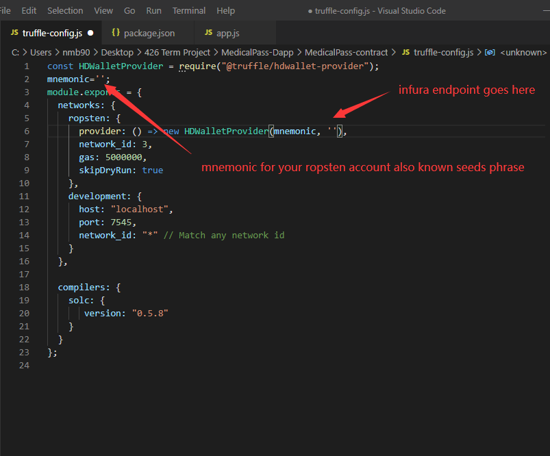
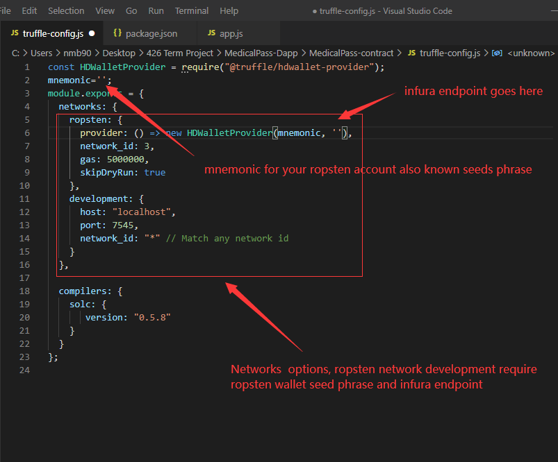
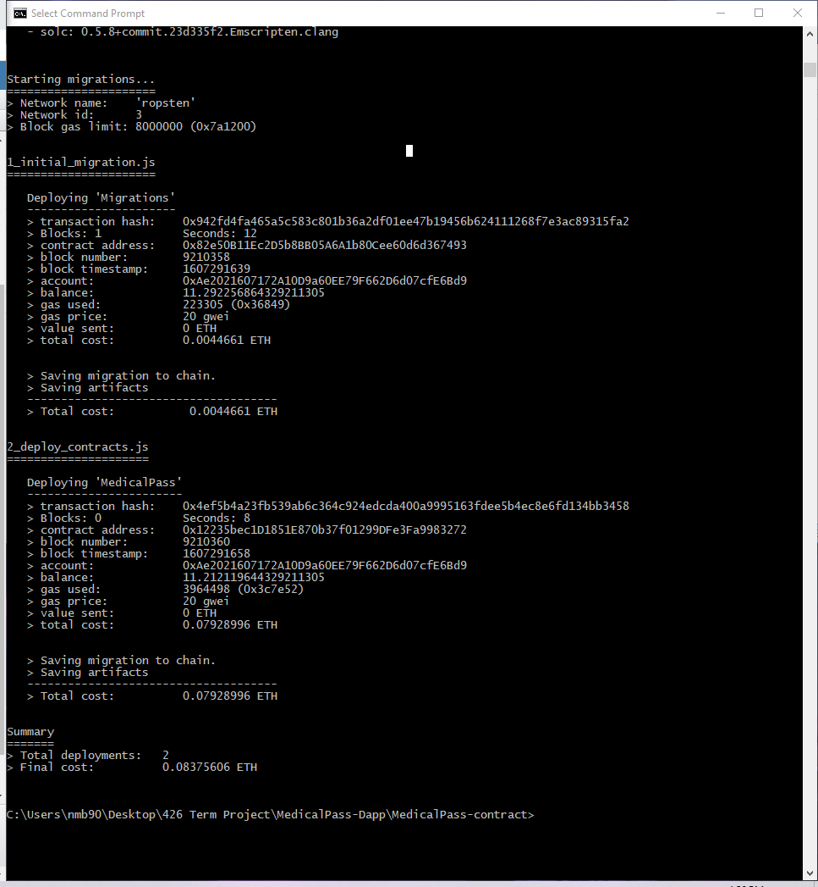
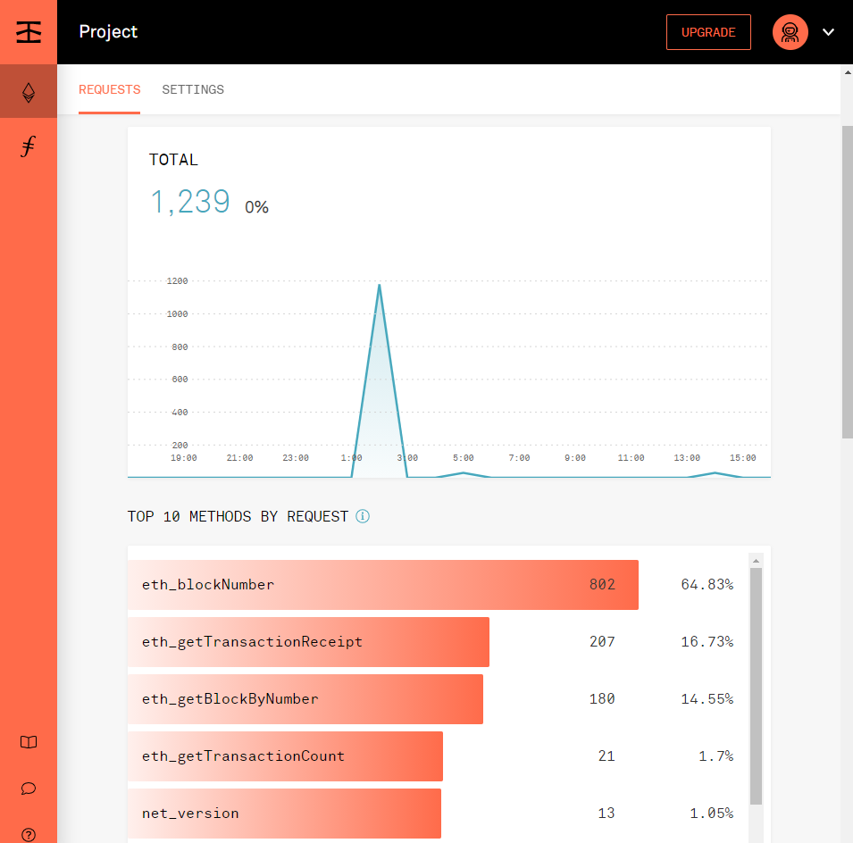
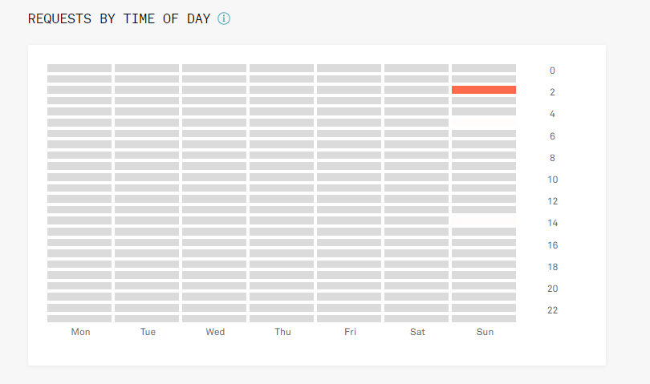
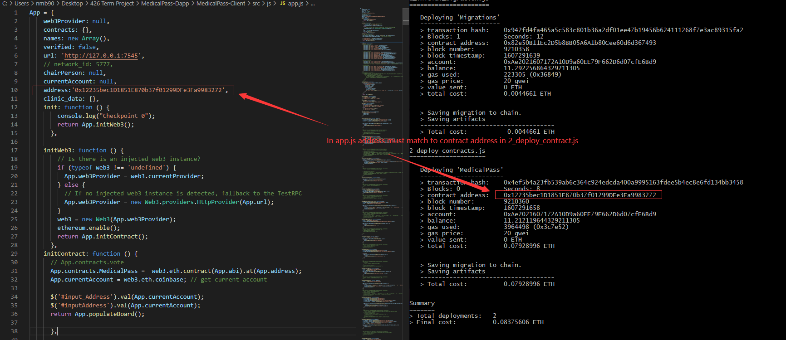
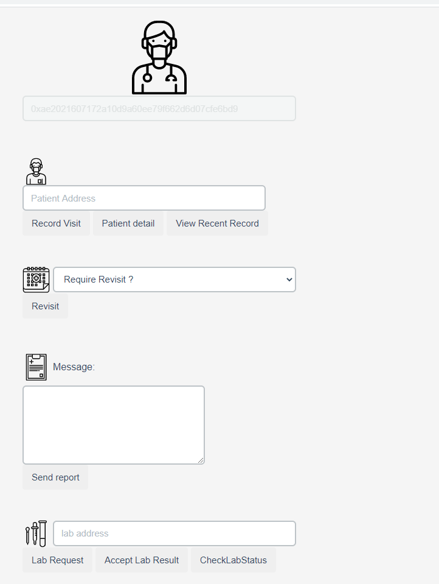

# Infura deployment requirement

1. You will need a ropsten account and its seed phrase which also known as mnemonic.
2. infura account with project enable, you will get infura endpoint. 
3. modification on truffle-configure.js which is located in truffle contract folder. 

# Steps:
### 1. open cmd change directory to MedicalPass-contract, then do npm install @truffle/hdwallet-provider. this will download required package for deploying on infura network

### 2. modify truffle_config.js in MedicalPass-contract directory.

### 3. then open cmd type truffle migrate -network ropsten, make sure you have build folder removed!

### if deployed succeed you can also view this change on infura,I have done some debugging you will see stats of my project request.

### if you use your own deployment and contract please make sure the contract address in app.js changed as well

### 4.Once you have the everything done change directory to MedicalPass-Dapp\MedicalPass-Client then npm start 

# How to interact with smart contract ?

## please visit readme in interact contract readme folder

