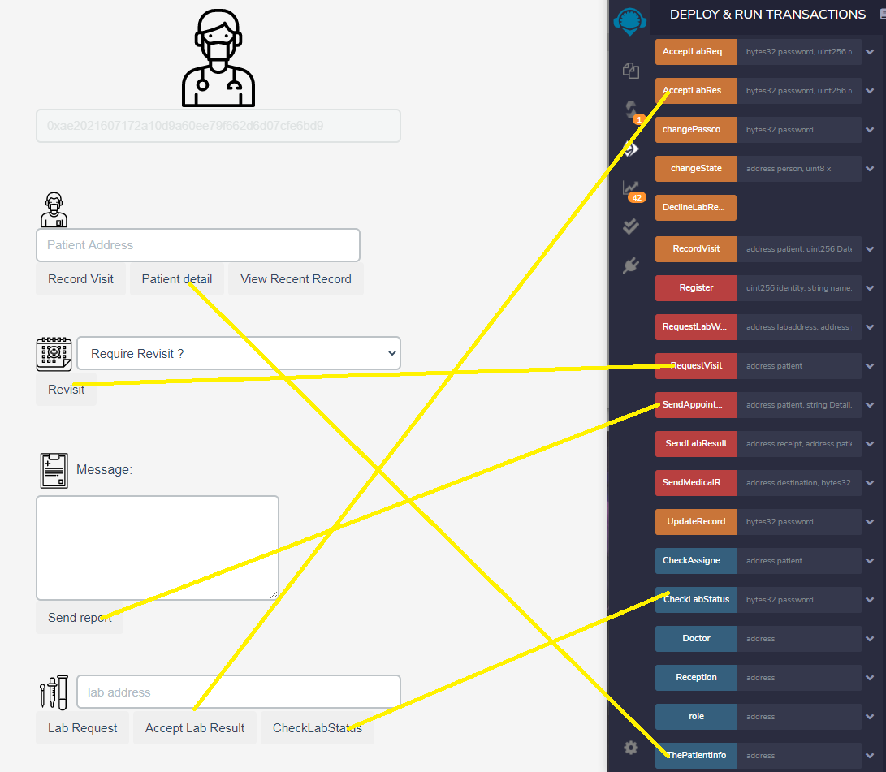
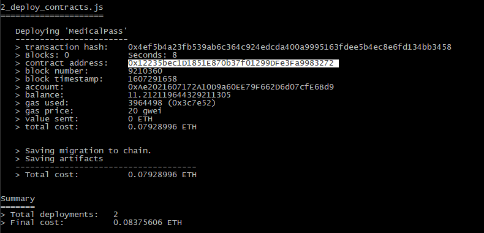
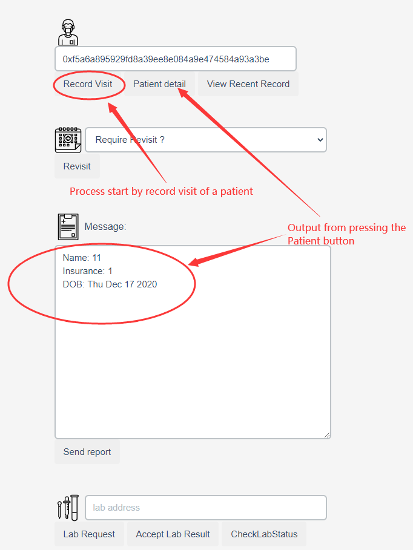
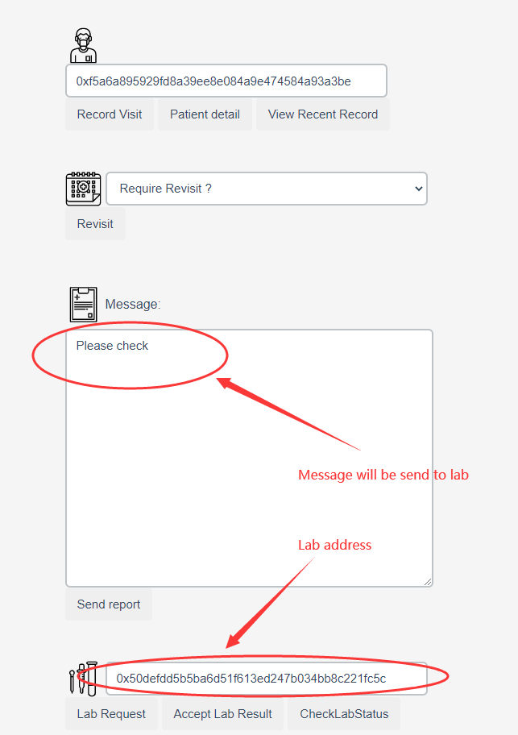
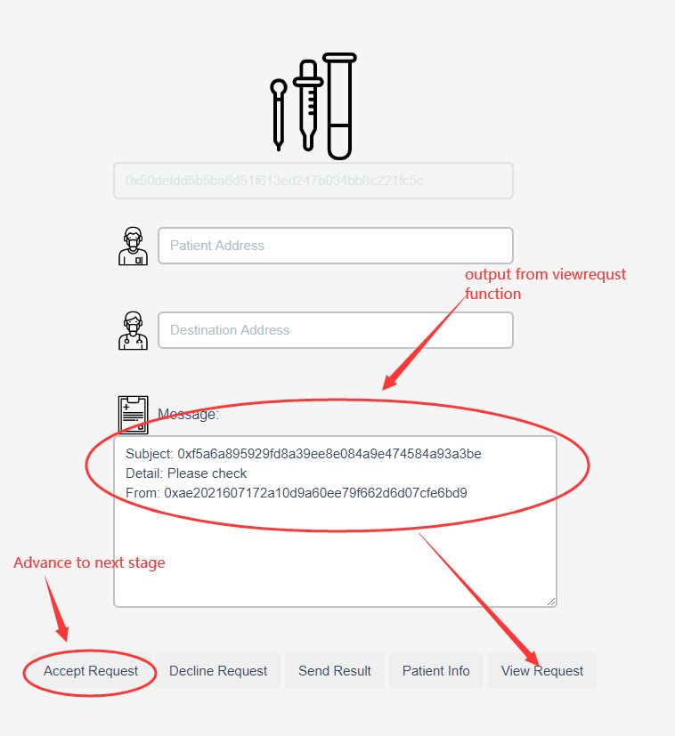
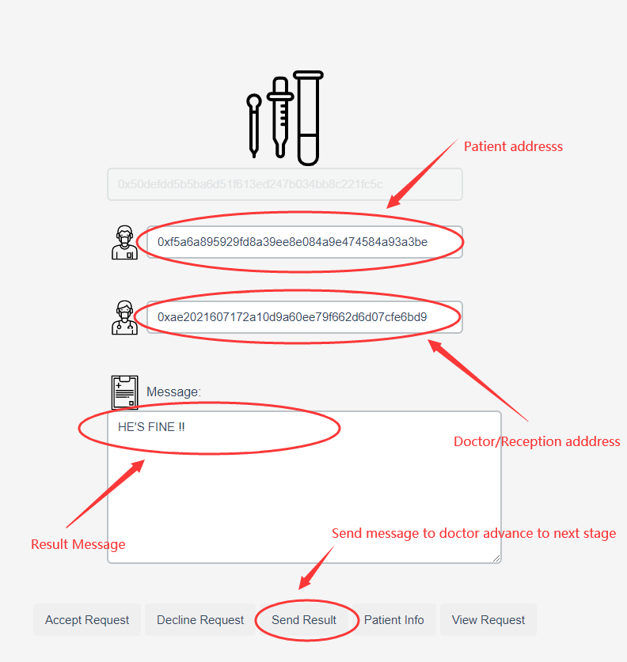
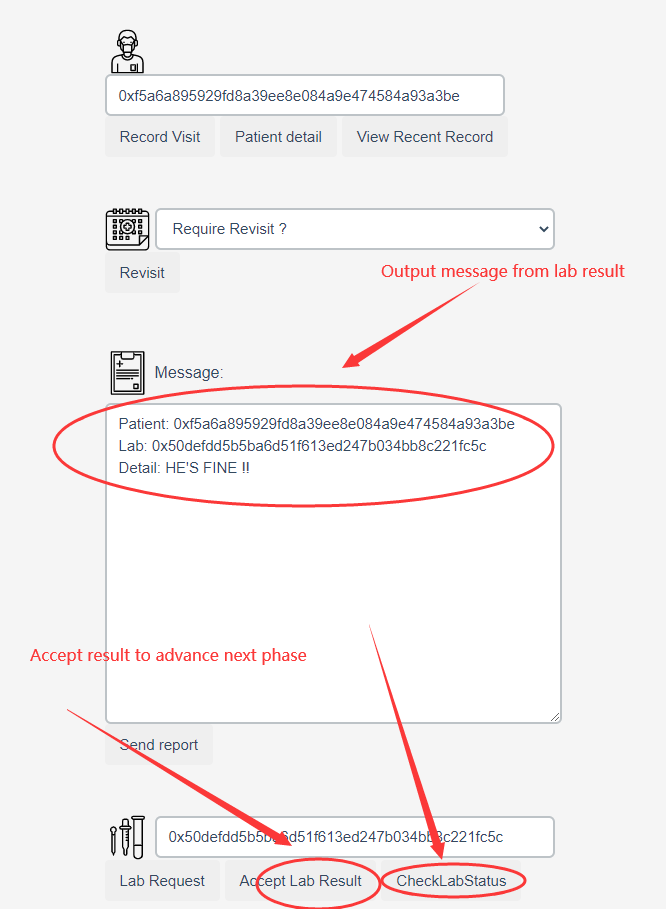
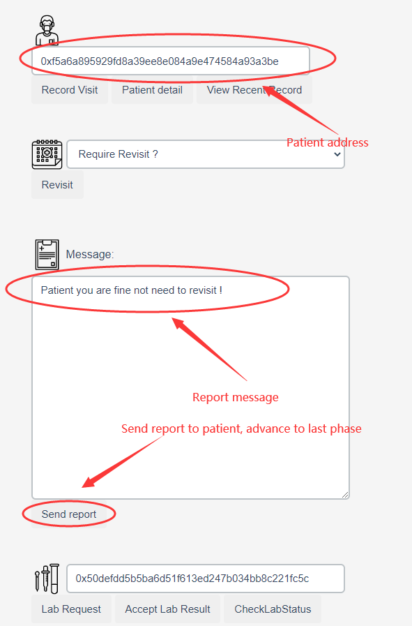
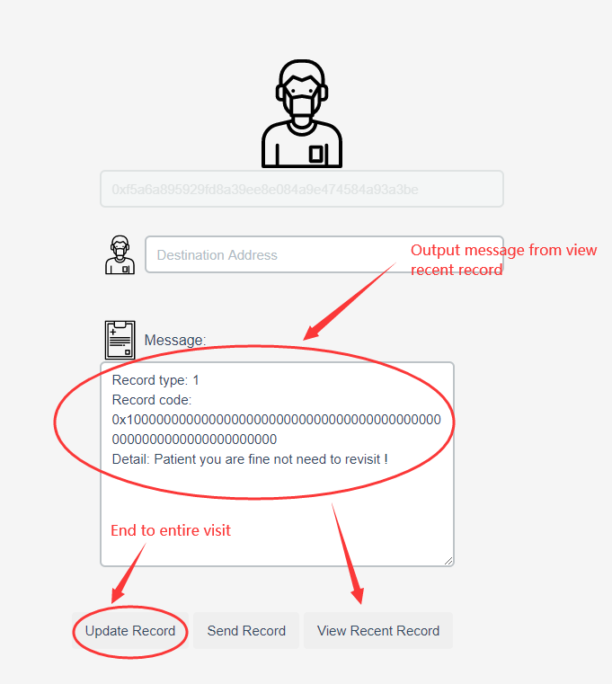
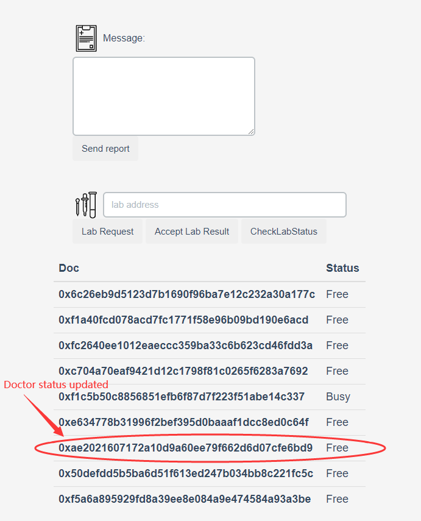

# Interact with smart contract in MedicalPass cilent
# PLEASE NPM INSTALL BEFORE PRORCEEDING 

### According to readme in Dapp folder each role with their unique interface and each function is bind to button 

### For Demo purpose I have deployed MedicalPass App on my end with contract address shown in the image, for security reason I cannot show infura endpoint.

# Demo

## There will be 2 parts for demo: Image demo and video demo. 

### For Video demo please go to this link: 

## Image demo will be following:

### Step 1:

### Step 2:

### Step 3:

### Step 4:

### Step 5:

### Step 6:

### Step 6:

### Step 7:

### Off-chain data:

