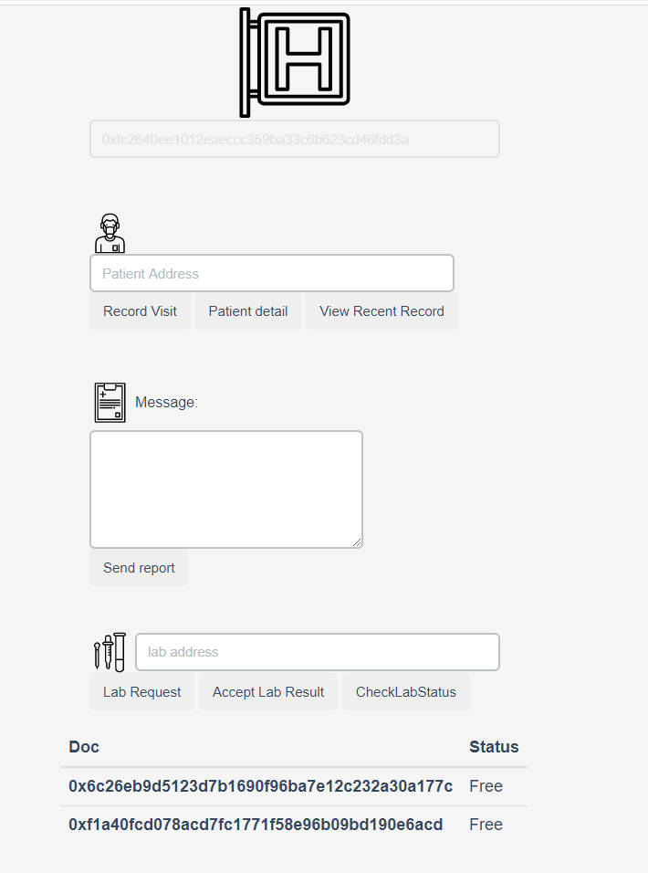
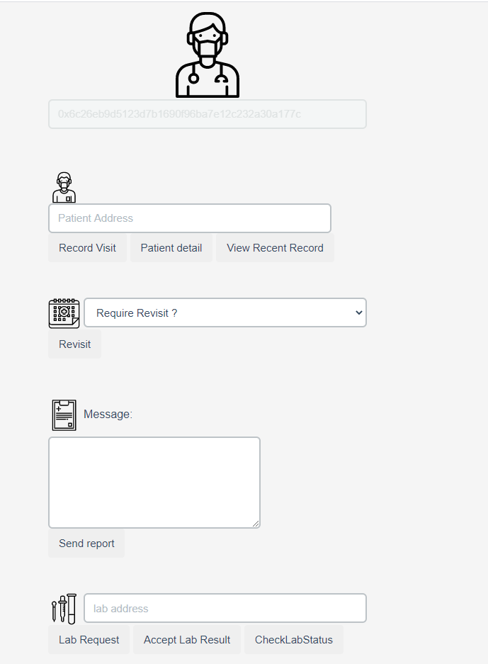
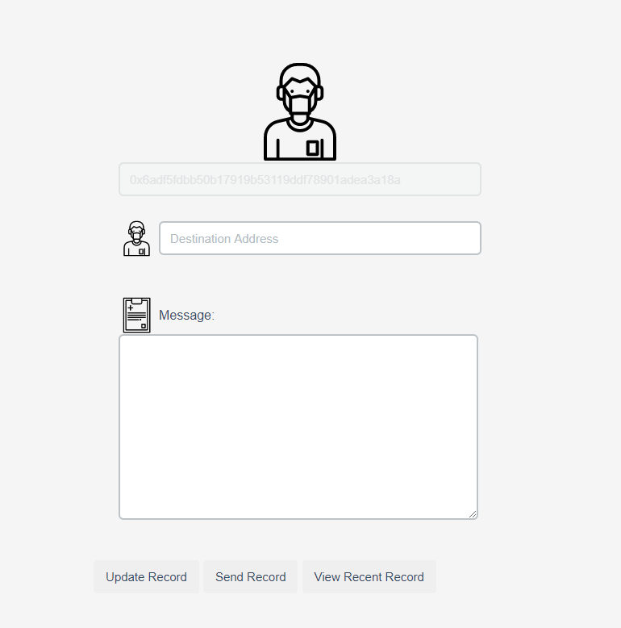
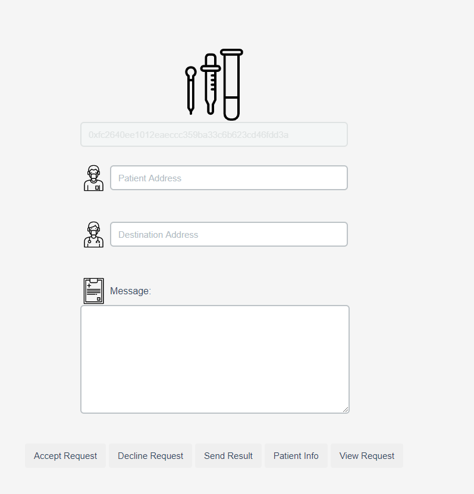
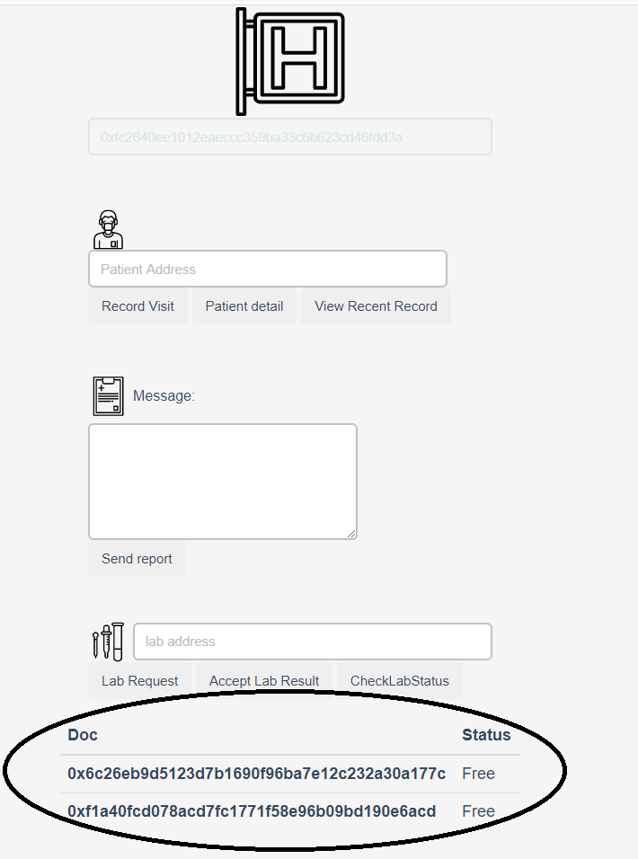
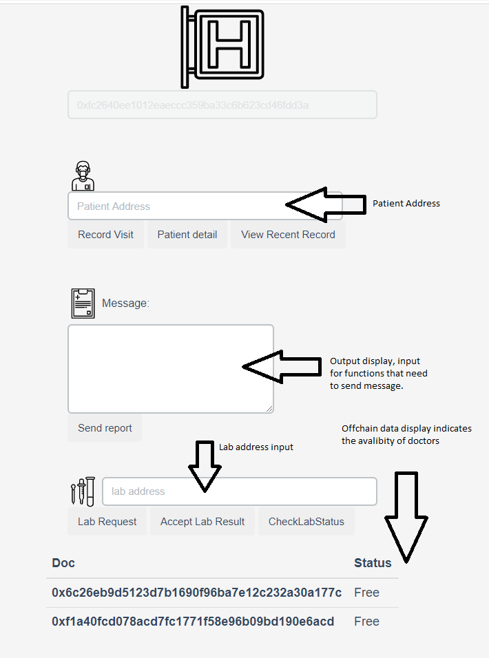
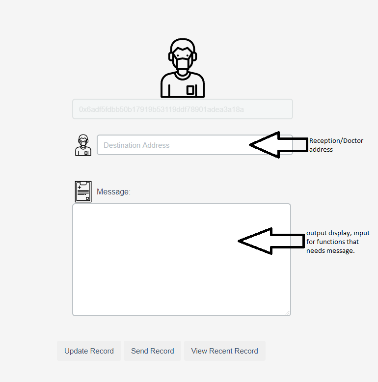
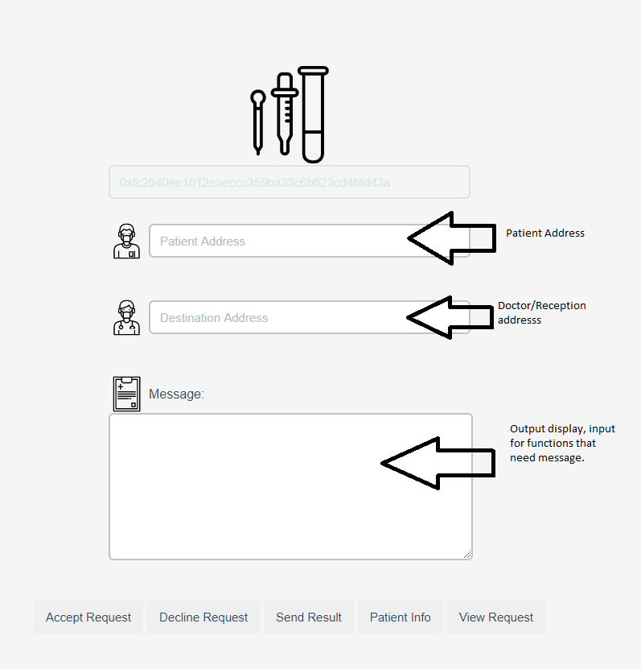

### MedicalPass Smart Contract

        struct PatientInfo{
            string name;patient name 
            uint Insurance; patient insurance number
            uint DOB; patient date of birth eg.08202000 -> 08/20/2000
            bool RequireVisit; -> state variable
            string ApptDetail; -> result from previous appointment. 
            bool UpdatedRecord; -> by default upon first initialization is true
        }

        struct lab{
            address patient; The address of patient that needs lab work
            address source; thr source of request for the patient
            string detail; exact detail on why/what lab work patient needs.
            bool UnresolvedRequest; state variable of previous request acceptance.
        }

### labrecorder can be doctor or reception.
        struct labRecorder{
            address patient; who is labwork for 
            address labaddress; which lab coming from 
            string LabResult; result of patients lab work
            bool RecordedLabResult; state variable of lab result being recorded or not.
        }
        struct doctor{
                    address patient; assigned patient 
        }
        
        struct reception{
            address patient;
        }
        
        struct record{
            this is format of medical record each address will have unique record corresponds to its own medical condition
            uint type_of_record;
            bytes32 code;
            string detail;
        }
        
        address chairperson;
        
        enum Phase{Idle,VisitStart,VisitEnd,LabworkStart,Labworkend}
        
## Events
event VisitStart(address patient);
event VisitEnd(address patient);
event LabworkStart(address patient);
event Labworkend(address patient);

**  mapping(address => Phase) individual_phase; -> each patient has unique phase when meeting with faculty members **         

## Events, Phases and its representation

    enum Phase{Idle,VisitStart,VisitEnd,LabworkStart,Labworkend}
    
    A Patient can have following 5 Phases: Idle,VisitStart,VisitEnd,LabworkStart,Labworkend Each phase restrictly force function disable on certain functions. Followings are explanation of how each events.

    RecordVisit() beginning of stages, which only allow to be accesssed when patients in Idle phase.

    When RecordVisit() is called, the VisitStart event emits represents the begin of visit process.

    When Doctor calls SendAppointmentDetail() patient's phase enter VisitEnd phase. 

    The patient has to call updateRecord() to complete entire cycle. 

    However, if a user needs lab examination, a doctor can call RequestLabWork(), lab calls acceptLabRequest(), patient's phase now entered LabworkStarted.

    When lab done with patient, calls SendLabResult(), Patient's Phase entered Labworkdone.

    Doctor calls SendAppointmentDetail() patient's phase enter VisitEnd phase. 

    The patient has to call updateRecord() to complete entire cycle. 

## Security, Hashing and Encryption/Decryption. 

- Current smart code is require all password to be byte32 

- Each address will have unique hashed identity

- Information hashing using follow Keccak256 method as well, but there's global hash code, but it can be modified by calling the changePasscode.

  Hash functions defined as follow:

    function hashMe( address value1, bytes32 password) private pure returns(bytes32 hashcode)
    {
        bytes32 hashedValue = keccak256(abi.encodePacked(value1, password));
        return hashedValue;
    }
    This code is retrieved from khash.sol
 
    function hashDetail(string memory ApptDetail)private view returns (bytes32 hashedValue){
              bytes32 hash = keccak256(abi.encodePacked(ApptDetail, passcode));
              return hash;
    }

## functions
- constructor(uint identity) 
    msg.sender has either to be doctor, reception, or lab. Patient cannot deploy this smart contract

- function Register (uint identity, string memory name,string memory Insurance,uint DOB,bytes32 password)
  Register given address with a identity, where identity is uint data type. the identity ranged from 1 - 4
  1: Patient
  2: Doctor
  3: Reception 
  4: Labotorary
  Each address should have its password when register and password is unique unless address is registered.
  
  if when register given identity is 1 means it's require to enter patient's personal information. Patient information will be mapped to struct

- function RequestVisit(address patient) 
  This function can only accessed by reception or doctor, this will update the patient require visit state to true

- function SendAppointmentDetail(address patient,string memory Detail,uint type_record,bytes32 code)
   This function can only called by the doctor. The function will update the medical detail to the given patient. The struct patientinfo wtih corresponding address will see their update. Detail will also be recorded
    record struct will be created mapped to given patient address. It changes current patient's phase into VisitEnd

- function RecordVisit(address patient, uint Date) 
    this function returns patient address, and date. data will recorded for future reference. change given patient phase to visit start require patient phase is idle. 

- function UpdateRecord() 
    This function is access by patient, patient cannot process any action unless their record is updated by them. Function set the updated variable to true, returns string of medical record. record will be saved on block.

- function RequestLabWork(address labaddress,address patient,string memory labdetail,bytes32 password)
    This function will access by reception or doctor, lab at lab address will receive an update on their struct, the patient that has specific detail will updated in lab struct.
    doctor or reception cannot send further request until previous was resolved. Require function caller to verify identity to be doctor himself/herself. 

- function SendLabResult(address receipt,address patient, string memory result)
    This function can only access by lab, the receipt can either be doctor or reception. each time the result sent. it will be recorded on the msg.sender end. change patient's phase to labworkdone.

- function AcceptLabResult(bytes32 password,uint result_id)
    This function will sees the changes made on labRecorder sections. The lab cannot send more result until previous is accepted. Require doctot/reception to enter password for verification, mapping given id to lab work.

- function DeclineLabRequest()
    This function will only access by lab, it does not record the detail it simply change the states to false. meaning request will ignored.

- function SendMedicalRecord(address destination)
    This function sends own address to destination.

## View functions 
-   function CheckLabStatus(bytes32 password) 
    Doctor/Reception can check previous patient lab status by entering password

-   function ViewLabRequestDetail(bytes32 password)
    lab can view most recent request submitted by reception/doctor by entering password

-   function ViewPatientInfo(address patient,bytes32 password)
    This function can only access by reception of medical facility, returns patients information. when request patient's information msg sender to enter the password unique to it's own address

- function ViewMostRecentPatientRecord(address patient,bytes32 password)
    This function allows personnel to check patient's record require password, matched with identity. 

## Example Use Case

# Note: Password can be any byte32 data type. For interpretation purpose, let phrase password equal to airbitary Byte32 data

        A calls Register (1,"Tianyu Chen",432583749,08202000,password) 
        A arranged appointment on Date D

        When A arrives at clinic 
        Reception C wants A person information

        A Calls SendMedicalRecord(address clinic)

        Once Reception C has the address of A

        Then 
        Reception C calls RecordVisit(address A, 02102018)
        Reception C calls ViewPatientInfo(address A,password) to see his information.

        Doctor D meet up with A
        A needs to get some labwork done.

        D calls RequestLabWork(lab address,patient address,string labdetail,password)

        Lab L sees the request
        L calls AcceptLabRequest(password,id)

        L done with lab work

        L calls SendLabResult(address receipt,address patient, string result,password)

        Lab Recorder can be either Doctor or Receipt, but Lab send to Doctor D

        D sees changes D calls AcceptLabResult(password) now Lab work of Patient A is recorded 

        D calls SendAppointmentDetail(address patient,string memory hashedDetail) to A, hashedDetail will recorded. 

        A sees appointment details noticed, A calls UpdateRecord. 

        A's visit process and details are recorded.
## WebUI and Its html

    Every role will get their unique which directly corresponding to functions can only be accessed by different roles.

    * if the image is not showing in the md reader please go to img folder under this same directory.

    When page first loads up you are required to select identity/role, such options are all provided in a dropdownlist. ONE OPTION MUST TO BE CHOSE IN ORDER TO PROCEED.

    Once you done with registration you should see a message on top-left corner indicates successful registration.

    Once you goes into your page you will get number button each button will directly associated with their function name. The button name is the function name. for those functionality please refers to top section. 

# IMPORTANT PROCEDUER
- In order make sure this Dapp work properly, following is pipeline must to followed:

        # Without Lab Work

        Registration -> Record Visit -> Send Report.

        # With Lab work 

        Registration -> Record Visit -> lab request -> lab request accept -> lab result send -> lab result accepted -> send appointment report. 

        ** if failed to follow above proceducer. You might have to Redeploy contract.

## Offchain Data
- We all been to medical facility before, the offchain data is the avalibility of different doctors. each doctor will get their status updated when visitStart and visitEnd, this information can only seen by reception 

In the bottom of Reception interface is the table of avabilities of two different doctors.

- When a doctor is signed up, it will marked as free, this initialization is default.

- offchain data can be found in db folder MedicalPass-app directory, it's called record.json

## Choice of Offchain Data

- Since most of interactions happened on blockchain, we can try keep max offchain maintain privacy.

## Interface explanation:

    

## Instruction
Open cmd in windows

Require Ganache,node.js, and truffle install on local machine

truffle is package can be downloaded using command npm install truffle. 

Once everything is functionally. 

Start Ganache choose quick start

then in cmd type following commands follow by enter key

- cd MedicalPass-Dapp 
- cd MedicalPass-contract 
- truffle compile 
- truffle migration --reset
- cd MedicalPass-app
- npm install
- npm start
- open chrome, make metamask is connected with local ganache wallet.
- type localhost:3000

By default smart contract depoly with current address assign to be reception

